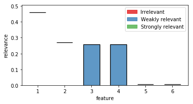

+++
title = "FRI Quickstart Guide"
subtitle = "How to use the FRI python library to discover relevant features."

# Add a summary to display on homepage (optional).
summary = ""

date = 2019-05-02T13:51:40+02:00
draft = false

# Authors. Comma separated list, e.g. `["Bob Smith", "David Jones"]`.
authors = ["admin"]

# Is this a featured post? (true/false)
featured = false

# Tags and categories
# For example, use `tags = []` for no tags, or the form `tags = ["A Tag", "Another Tag"]` for one or more tags.
tags = ["guide","fri","python","notebook"]
categories = ["guide","python"]

# Projects (optional).
#   Associate this post with one or more of your projects.
#   Simply enter your project's folder or file name without extension.
#   E.g. `projects = ["deep-learning"]` references 
#   `content/project/deep-learning/index.md`.
#   Otherwise, set `projects = []`.
 projects = ["fri"]

# Featured image
# To use, add an image named `featured.jpg/png` to your page's folder. 
[image]
  # Caption (optional)
  caption = ""

  # Focal point (optional)
  # Options: Smart, Center, TopLeft, Top, TopRight, Left, Right, BottomLeft, Bottom, BottomRight
  focal_point = "Right"
+++

# Quick start guide
In this guide i am going describe how to use the FRI python library to analyse arbitrary datasets.

(This guide is a copy of the official documentation found [here](https://lpfann.github.io/fri/notebooks/Guide.html))

## Installation
### Stable
Fri can be installed via the Python Package Index (PyPI).

If you have `pip` installed just execute the command

    pip install fri
   
to get the newest stable version.

The dependencies should be installed and checked automatically.
If you have problems installing please open issue at our [tracker](https://github.com/lpfann/fri/issues/new).

### Development
To install a bleeding edge dev version of `FRI` you can clone the GitHub repository using

    git clone git@github.com:lpfann/fri.git

and then check out the `dev` branch: `git checkout dev`.

To check if everything works as intented you can use `pytest` to run the unit tests.
Just run the command

    pytest

in the main project folder


```python
# For the purpose of viewing this notebook online we install the library directly with pip
!pip install fri
```

    Requirement already satisfied: fri in /home/lpfannschmidt/workbench/fri (3.4.0+2.g1eb5429.dirty)
    Requirement already satisfied: numpy in /home/lpfannschmidt/anaconda3/lib/python3.7/site-packages (from fri) (1.15.1)
    Requirement already satisfied: scipy>=0.19 in /home/lpfannschmidt/anaconda3/lib/python3.7/site-packages (from fri) (1.1.0)
    Requirement already satisfied: scikit-learn>=0.18 in /home/lpfannschmidt/anaconda3/lib/python3.7/site-packages (from fri) (0.19.2)
    Requirement already satisfied: cvxpy==1.0.8 in /home/lpfannschmidt/anaconda3/lib/python3.7/site-packages (from fri) (1.0.8)
    Requirement already satisfied: ecos==2.0.5 in /home/lpfannschmidt/anaconda3/lib/python3.7/site-packages (from fri) (2.0.5)
    Requirement already satisfied: matplotlib in /home/lpfannschmidt/anaconda3/lib/python3.7/site-packages (from fri) (2.2.3)
    Requirement already satisfied: scs>=1.1.3 in /home/lpfannschmidt/anaconda3/lib/python3.7/site-packages (from cvxpy==1.0.8->fri) (2.0.2)
    Requirement already satisfied: toolz in /home/lpfannschmidt/anaconda3/lib/python3.7/site-packages (from cvxpy==1.0.8->fri) (0.9.0)
    Requirement already satisfied: multiprocess in /home/lpfannschmidt/anaconda3/lib/python3.7/site-packages (from cvxpy==1.0.8->fri) (0.70.6.1)
    Requirement already satisfied: osqp in /home/lpfannschmidt/anaconda3/lib/python3.7/site-packages (from cvxpy==1.0.8->fri) (0.4.1)
    Requirement already satisfied: fastcache in /home/lpfannschmidt/anaconda3/lib/python3.7/site-packages (from cvxpy==1.0.8->fri) (1.0.2)
    Requirement already satisfied: six in /home/lpfannschmidt/anaconda3/lib/python3.7/site-packages (from cvxpy==1.0.8->fri) (1.11.0)
    Requirement already satisfied: cycler>=0.10 in /home/lpfannschmidt/anaconda3/lib/python3.7/site-packages (from matplotlib->fri) (0.10.0)
    Requirement already satisfied: pyparsing!=2.0.4,!=2.1.2,!=2.1.6,>=2.0.1 in /home/lpfannschmidt/anaconda3/lib/python3.7/site-packages (from matplotlib->fri) (2.2.0)
    Requirement already satisfied: python-dateutil>=2.1 in /home/lpfannschmidt/anaconda3/lib/python3.7/site-packages (from matplotlib->fri) (2.7.3)
    Requirement already satisfied: pytz in /home/lpfannschmidt/anaconda3/lib/python3.7/site-packages (from matplotlib->fri) (2018.5)
    Requirement already satisfied: kiwisolver>=1.0.1 in /home/lpfannschmidt/anaconda3/lib/python3.7/site-packages (from matplotlib->fri) (1.0.1)
    Requirement already satisfied: dill>=0.2.8.1 in /home/lpfannschmidt/anaconda3/lib/python3.7/site-packages (from multiprocess->cvxpy==1.0.8->fri) (0.2.8.2)
    Requirement already satisfied: future in /home/lpfannschmidt/anaconda3/lib/python3.7/site-packages (from osqp->cvxpy==1.0.8->fri) (0.16.0)
    Requirement already satisfied: setuptools in /home/lpfannschmidt/anaconda3/lib/python3.7/site-packages (from kiwisolver>=1.0.1->matplotlib->fri) (40.2.0)


## Using FRI
Now we showcase the workflow of using FRI on a simple classification problem.

### Data
To have something to work with, we need some data first.
`fri` includes a generation method for binary classification and regression data.

In our case we need some classification data.


```python
from fri import genClassificationData
```

We want to create a small set with a few features.

Because we want to showcase the all-relevant feature selection, we generate multiple strongly and weakly relevant features.


```python
n = 100
features = 6
strongly_relevant = 2
weakly_relevant = 2
```


```python
X,y = genClassificationData(n_samples=n,
                            n_features=features,
                            n_strel=strongly_relevant,
                            n_redundant=weakly_relevant,
                            random_state=123)
```

    Generating dataset with d=6,n=100,strongly=2,weakly=2, partition of weakly=None


The method also prints out the parameters again.


```python
X.shape
```


    (100, 6)


We created a binary classification set with 6 features of which 2 are strongly relevant and 2 weakly relevant.

#### Preprocess
Because our method expects mean centered data we need to standardize it first.
This centers the values around 0 and deviation to the standard deviation


```python
from sklearn.preprocessing import StandardScaler
X_scaled = StandardScaler().fit_transform(X)
```

### Model
Now we need to creata a Model. 
We use the `FRIClassification` class.

For regression one would use `FRIRegression`


```python
from fri import FRIClassification
fri_model = FRIClassification()
```


```python
fri_model
```


    FRIClassification(C=None, debug=False, n_resampling=3,
             optimum_deviation=0.001, parallel=False, random_state=None)


We used no parameters for creation so the defaults are active.

`C=None` means, that `FRI` itself chooses the regularization parameter `C` using crossvalidation on a fixed grid.

By default, parallel computation is also disabled but can be enabled using `parallel=True`.

#### Fitting to data
Now we can just fit the model to the data using `scikit-learn` like commands.


```python
fri_model.fit(X_scaled,y)
```

The resulting feature relevance bounds are saved in the `interval_` variable.


```python
fri_model.interval_
```


    array([[0.45993233, 0.46169499],
           [0.26954548, 0.27159876],
           [0.        , 0.25802293],
           [0.        , 0.25802293],
           [0.00516909, 0.00711219],
           [0.00446591, 0.00694219]])


```python
fri_model.interval_.shape
```


    (6, 2)


The bounds are grouped in 2d sublists for each feature.


To acess the relevance bounds for feature 2 we would use


```python
fri_model.interval_[2]
```


    array([0.        , 0.25802293])


The relevance classes are saved in the corresponding variable `relevance_classes_`:


```python
fri_model.relevance_classes_
```


    array([2, 2, 1, 1, 0, 0])


`2` denotes strongly relevant features, `1` weakly relevant and `0` irrelevant.

#### Plot results

The bounds in numerical form are useful for postprocesing.
If we want a human to look at it, we recommend the plot function `plot_relevance_bars`.

We can also color the bars according to `relevance_classes_`


```python
# Import plot function
from fri.plot import plot_relevance_bars
import matplotlib.pyplot as plt
%matplotlib inline
# Create new figure, where we can put an axis on
fig, ax = plt.subplots(1, 1,figsize=(6,3))
# plot the bars on the axis, colored according to fri
out = plot_relevance_bars(ax,fri_model.interval_,classes=fri_model.relevance_classes_)
```





In the plot we can see both strongly relevant features 1 and 2 not allowing much change in their contribution.
Feature 3 and 4 are highly correlated and show therefore a big variance.
Noise features 5 and 6 show some necessary contribution which can be accounted to numerical instabilities of the solver.

### Print internal Parameters

If we want to take at internal parameters, we can use the `debug` flag in the model creation.


```python
fri_model = FRIClassification(debug=True)
```


```python
fri_model.fit(X_scaled,y)
```

    loss 0.517120931358002
    L1 6.743126681372926
    offset 0.32474176019022094
    C 1
    score 1.0
    coef:
    [[ 3.10516847]
     [-1.82001413]
     [ 0.86614471]
     [-0.86614471]
     [-0.03919911]
     [-0.03971916]]


This prints out the parameters of the baseline model `loss` (sum of slack), `L1` ($L_1$ norm of weight vector) and `offset` (from the origin).
`coef` shows the coefficients of the baseline model.

One can also see the best `C` according to gridsearch and the training score of the model in `score`.

These values can also be accessed by the object variables.

##### Print out hyperparameter found by GridSearchCV:


```python
fri_model.tuned_C_
```


    1


or the baseline parameters:


```python
fri_model.optim_L1_
```


    6.743126681372926


### Setting constraints manually
Our model also allows to compute relevance bounds when the user sets a given range for the features.

#### Presets
Presets are encoded using a array in the same shape as the `interval_` variable.
Each value represents the user given minimum and maximum contribution of the feature.
If one would set both values to be the same, we interpret this feature as fixed.

Additionally, entries with `np.nan` are interpreted as not-set or free.


```python
import numpy as np
preset = np.full_like(fri_model.interval_,np.nan,dtype=np.double)
```

Now we have a preset array without any constraints:


```python
preset
```


    array([[nan, nan],
           [nan, nan],
           [nan, nan],
           [nan, nan],
           [nan, nan],
           [nan, nan]])


#### Example
As an example, let us constrain feature 3 from our example to the minimum relevance bound.

Note the different indexing using numpy (3 -> 2)


```python
preset[2] = fri_model.interval_[2, 0]
```

We use the function `constrained_intervals_`.

Note: we need to fit the model before we can use this function.
We already did that, so we are fine.


```python
constrained_interval = fri_model.constrained_intervals_(preset=preset)
```


```python
constrained_interval
```


    array([[0.45993233, 0.46169499],
           [0.26954548, 0.27159876],
           [0.        , 0.        ],
           [0.25608488, 0.25802293],
           [0.00516909, 0.00711219],
           [0.00446591, 0.0069422 ]])


Feature 3 is set to its minimum (at 0).

How does it look visually?


```python
fig, ax = plt.subplots(1, 1,figsize=(6,3))
out = plot_relevance_bars(ax, constrained_interval)
```


Feature 3 is reduced to its minimum (no contribution).

In turn, its correlated partner feature 4 had to take its maximum contribution.
